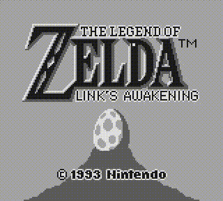
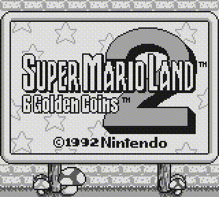
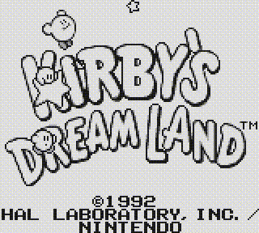
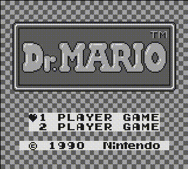
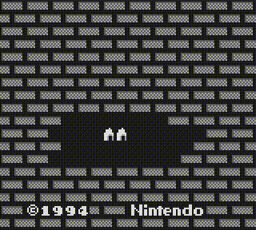

# 🎮 BoyBoy

[](https://isocpp.org/)
[](https://www.linux.org/)
[](LICENSE)

[](https://github.com/sebdevnull/boyboy/releases/latest)

**BoyBoy** is a work-in-progress **Game Boy emulator** written in C++23, designed to be accurate, maintainable, and easy for developers to explore and extend.  
It implements a complete CPU core, memory management, and a functional PPU for graphics rendering.  
BoyBoy provides a hands-on platform for learning about emulator development and low-level programming.

---

## Table of Contents

- [🎮 BoyBoy](#-boyboy)
  - [Gameplay](#gameplay)
  - [Project goals](#project-goals)
  - [Project status](#project-status)
  - [Planned features](#planned-features)
  - [Resources](#resources)
    - [Technical references](#technical-references)
    - [CPU instruction references](#cpu-instruction-references)
    - [Emulation](#emulation)
    - [Test ROMs](#test-roms)
  - [Dependencies](#dependencies)
  - [Build instructions](#build-instructions)
  - [Usage](#usage)
    - [Running a ROM](#running-a-rom)
    - [Managing Configuration](#managing-configuration)
    - [Inspecting ROM Information](#inspecting-rom-information)
  - [Known Issues](#known-issues)
  - [Test ROMs](#test-roms-1)
  - [Legal notice](#legal-notice)

---

## Gameplay

|  |  |  |
|:---------------------:|:---------------------:|:---------------------:|
| *The Legend of Zelda: Link's Awakening* | *Super Mario Land 2: 6 Golden Coins* | *Kirby's Dream Land* |

|  |  |  |
|:---------------------:|:---------------------:|:---------------------:|
| *Tetris*     | *Dr. Mario*  | *Donkey Kong* |

> For full ROM compatibility status, check [Tested ROMs](docs/TestedROMs.md#games).

---

## Project goals

**BoyBoy** aims to be an accurate, maintainable, and developer-friendly Game Boy emulator.

The project is designed to:

- Faithfully emulate original Game Boy hardware: CPU, memory, I/O, graphics, and audio
- Run commercial and homebrew ROMs  
- Provide a developer-friendly debugging and testing environment
- Serve as a hands-on learning platform for emulator development and low-level programming for the community

---

## Project status

**BoyBoy** is currently in active development.  

**Current version:** [`v0.5.0`](CHANGELOG.md#050---2025-10-16)  

**Development stage:** Ongoing improvements and feature implementation.

**Progress overview:**

| Component             | Status        |
|-----------------------|---------------|
| CPU core              | ✅ Implemented |
| Memory & DMA          | ✅ Implemented |
| ROM & Cartridge       | ⏳ Partial     |
| PPU (graphics)        | ✅ Implemented |
| APU (audio)           | ❌ Not started |
| I/O & Peripherals     | ⏳ Partial     |
| CLI/GUI & Extras      | ⏳ Partial     |
| Testing & Validation  | ⏳ Partial     |

> For a detailed feature checklist, see [Feature Checklist](/docs/Checklist.md).  
> For detailed progress and changes, see [CHANGELOG](/CHANGELOG.md).

---

## Planned features

The following features are planned for future releases, in rough order of priority:

**Core:**

- **Boot ROM** – Authentic startup sequence
- **Timing accuracy** – More accurate CPU and PPU timing
- **Emulator state saves** – Save and restore emulator state
- **Optimizations** – Further performance improvements

**Hardware:**

- **Cartridge support** – MBC2, MBC3, MBC5, battery-backed RAM, RTC
- **Audio (APU)** – Full audio emulation  

**Tools & UI:**

- **Debugging tools** – Breakpoints, step execution, memory/state inspection  
- **GUI frontend** – Window management, controls, and visualization  
- **CLI improvements** – More options and features

**Other:**

- **Testing** – Additional test ROMs to verify compatibility
- **Cross-platform** – Windows and macOS support  

---

## Resources

The following resources have been used in BoyBoy's development and may help you understand Game Boy hardware and emulation concepts:

- [**Awesome Game Boy Development**](https://github.com/gbdev/awesome-gbdev) – Curated (and ***awesome***) list of Game Boy development resources. The only list you'll ever need!

### Technical references

- [**Pan Docs**](https://gbdev.io/pandocs/) – The ***definitive*** technical reference for Game Boy hardware.
- [**Game Boy: Complete Technical Reference**](https://gekkio.fi/files/gb-docs/gbctr.pdf) – Comprehensive technical reference by [Gekkio](https://gekkio.fi/).
- [**The Cycle-Accurate Game Boy Docs**](https://github.com/AntonioND/giibiiadvance/blob/master/docs/TCAGBD.pdf) – Detailed analysis focused on cycle accuracy by [AntonioND](https://github.com/AntonioND).

### CPU instruction references

- [**Opcodes table**](https://gbdev.io/gb-opcodes/optables/) – Visual opcode table with cycle counts and flags. Views in hex and octal.
- [**Opcodes JSON**](https://gbdev.io/gb-opcodes/Opcodes.json) – Complete instruction set in JSON format (***great for parsing!***).
- [**Opcodes reference**](https://rgbds.gbdev.io/docs/v0.9.4/gbz80.7) – Detailed reference for the Game Boy CPU instruction set.

### Emulation

- [**Emulation of Nintendo Game Boy**](https://github.com/Baekalfen/PyBoy/blob/master/extras/PyBoy.pdf) – Academic paper on Game Boy emulation implementation in Python for the [PyBoy emulator](https://github.com/Baekalfen/PyBoy).

### Test ROMs

- [**Blargg's Test ROMs**](https://github.com/retrio/gb-test-roms) – Widely used test ROMs for CPU, PPU, and other hardware verification.
- [**dmg-acid2**](https://github.com/mattcurrie/dmg-acid2) – Basic PPU rendering test ROM.

---

## Dependencies

To build **BoyBoy**, the following libraries are required:

- [glad](https://github.com/Dav1dde/glad) – For loading OpenGL functions (included pregenerated header-only version in `external/glad/`)
- [SDL2](https://www.libsdl.org/) – For window management, input handling, and audio  
- OpenGL – For rendering graphics  

On Linux (Debian/Ubuntu), you can install them with:

```bash
sudo apt update
sudo apt install libsdl2-dev libglu1-mesa-dev mesa-common-dev
```

Make sure you have **CMake 3.27+** and a C++23 compiler.

---

## Build instructions

**Using CMake presets (recommended):**

1. Create and configure a build:

    ```bash
    cmake --preset release   # or 'debug'
    ```

2. Build the project:

    ```bash
    cmake --build --preset release
    ```

3. Run tests:

    ```bash
    ctest --preset release
    ```

Or run the complete workflow in one command:

  ```bash
  ctest --workflow --preset release
  ```

---

## Usage

After building BoyBoy, you can run the emulator, manage configuration, or inspect ROM metadata using the command-line interface.  
For additional information on how to run the emulator or a specific command run with `--help`.

**Help examples:**

  ```bash
  boyboy --help
  boyboy run --help
  ```

---

### Running a ROM

Use the `run` subcommand to start a ROM. Command-line options override any configuration file settings.

#### Usage

  ```bash
  boyboy run path/to/rom.gb [OPTIONS]
  ```

#### Options

- `-c, --config <file>` : Path to a configuration file  
- `--scale <factor>` : Display scaling factor (`x1`, `x2`, `x3`, etc.)  
- `--speed <multiplier>` : Emulation speed (`0 = uncapped`, `1 = normal`, `2 = double`, etc.)  
- `--vsync <bool>`: Enable or disable vertical synchronization  
- `--log-level <level>` : Logging verbosity (`trace`, `debug`, `info`, `warn`, `error`, `critical`, `off`)
- `--save-file <file>`: Battery save file for the ROM being run
- `--autosave <bool>`: Enable or disable battery autosave
- `--save-interval <ms>`: Autosave interval in milliseconds

#### Examples

  ```bash
  boyboy run path/to/rom.gb
  boyboy run path/to/rom.gb --config path/to/config.toml
  boyboy run path/to/rom.gb --scale 2 --speed 2 --vsync 0
  ```

---

### Managing Configuration

Use the `config` subcommand to view or modify emulator settings.

#### Usage

  ```bash
  boyboy config [OPTIONS] SUBCOMMAND
  ```

#### Options

- `-c, --config <file>` : Path to the configuration file  

#### Subcommands

- `get <key>` : Get a configuration value  
- `set <key> <value>` : Set a configuration value  
- `list` : List all configuration values  
- `reset` : Reset configuration to default  

#### Examples

  ```bash
  boyboy config get emulator.speed
  boyboy config set video.vsync false
  boyboy config --config path/to/config.toml list
  boyboy config reset
  ```
  
---

### Inspecting ROM Information

Use the `info` subcommand to display metadata about a ROM.

#### Usage

  ```bash
  boyboy info <rom>
  ```

#### Example

  ```bash
  boyboy info path/to/rom.gb
  ```

---

## Known Issues

- **D-Bus/SDL2 memory leaks**: On Linux, running BoyBoy with AddressSanitizer (on debug builds) may report small leaks from `dbus` symbols.
These leaks are caused by SDL2 interacting with the D-Bus system and are **harmless**.  
When running a debug build, use the provided wrapper script (`scripts/run_boyboy.sh`) to automatically suppress these leaks.  
For more information about suppressed leaks, check `config/asan_suppress.txt`.

---

## Test ROMs

This project includes several ROMs for emulator testing and verification.

> See [Tested ROMs](docs/TestedROMs.md#test-roms) for test ROMs passing status.  

The included test ROMs are:

- **blargg’s Game Boy test ROMs** – stored under `tests/roms/cpu/blargg/`, widely used for CPU, PPU, and other hardware verification  
  - [GitHub repository](https://github.com/retrio/gb-test-roms)  

- **dmg-acid2** – stored under `tests/roms/ppu/dmg-acid2.gb`, a PPU test ROM by Matt Currie (MIT license)
  - [GitHub repository](https://github.com/mattcurrie/dmg-acid2)

- **GameBoyLife ROM** – stored under `tests/roms/misc/gameboylife/` by NovaSquirrel (zlib license)  
  - [GitHub repository](https://github.com/NovaSquirrel/GameBoyLife)
  - [Itch.io page](https://novasquirrel.itch.io/conways-life-for-game-boy)

- **Custom ROMs** – stored under `tests/roms/misc/custom/`  
  - `invalid.gb` – created to test invalid or malformed data handling  

> See [Third-Party Licenses](LICENSE-THIRD-PARTY.md) for detailed attribution, licenses, and legal notices.

## Legal notice

- **BoyBoy** is an independent project and is **not affiliated with or endorsed by Nintendo**.  
- The Game Boy name, logo, and related trademarks are property of **Nintendo Co., Ltd.**  
- See [Third-Party Licenses](LICENSE-THIRD-PARTY.md) for third-party attributions and disclaimers.  
