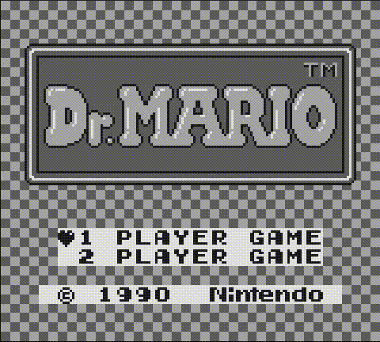
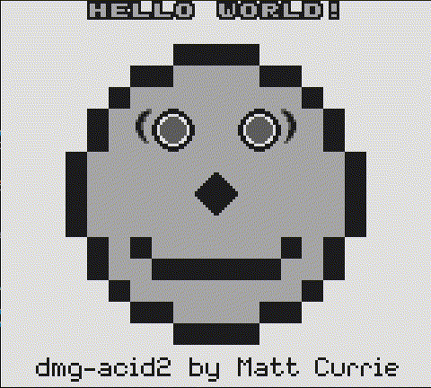

# 🎮 BoyBoy

[](https://isocpp.org/)
[](https://www.linux.org/)
[](LICENSE)

**BoyBoy** is a work-in-progress **Game Boy emulator** written in C++23, focusing on accuracy and learning.

|     |     |
|-----|-----|
|  |  |
| *Dr. Mario gameplay* | *PPU & CPU test suite (dmg-acid2 + Blargg)* |

## Project status

**Development stage:** Early development, not playable yet.

**Progress overview:**

| Component             | Status        |
|-----------------------|---------------|
| CPU core              | ✅ Implemented |
| Memory & DMA          | ✅ Implemented |
| ROM & Cartridge       | ⏳ Partial     |
| PPU (graphics)        | ✅ Implemented |
| APU (audio)           | ❌ Not started |
| I/O & Peripherals     | ⏳ Partial     |
| CLI/GUI & Extras      | ⏳ Partial     |
| Testing & Validation  | ⏳ Partial     |

**Current milestone:** `v0.2.0` - PPU functional - Almost complete PPU implementation including background, window, and sprite rendering, LCD control and status handling, VRAM and OAM management, DMA integration, joypad input handling, SDL2/glad rendering backend, and a demo playable with Dr. Mario.

> For a detailed feature checklist, see [ROADMAP](docs/ROADMAP.md).

## Project goals

**BoyBoy** aims to be an accurate, maintainable, and developer-friendly Game Boy emulator.

The project is designed to:

- Faithfully emulate original Game Boy hardware: CPU, memory, I/O, graphics, and audio
- Run commercial and homebrew ROMs  
- Provide a developer-friendly debugging and testing environment
- Serve as a hands-on learning platform for emulator development and low-level programming

## Dependencies

To build **BoyBoy**, the following libraries are required:

- [glad](https://github.com/Dav1dde/glad) – For loading OpenGL functions (included pregenerated header-only version in `external/glad/`)
- [SDL2](https://www.libsdl.org/) – For window management, input handling, and audio  
- OpenGL – For rendering graphics  

On Linux (Debian/Ubuntu), you can install them with:

```bash
sudo apt update
sudo apt install libsdl2-dev libglu1-mesa-dev mesa-common-dev
```

Make sure you have **CMake 3.27+** and a C++23 compiler.

## Build instructions

**Using CMake presets (recommended):**

1. Create and configure a build:

    ```bash
    cmake --preset debug   # or 'release'
    ```

2. Build the project:

    ```bash
    cmake --build --preset debug
    ```

3. Run tests:

    ```bash
    ctest --preset debug
    ```

## Test ROMs

This project includes several ROMs for emulator testing and verification:

- **blargg’s Game Boy test ROMs** – stored under `tests/roms/cpu/blargg/`, widely used for CPU, PPU, and other hardware verification  
  - [GitHub repository](https://github.com/retrio/gb-test-roms)  

- **dmg-acid2** – stored under `tests/roms/ppu/dmg-acid2.gb`, a PPU test ROM by Matt Currie (MIT license)
  - [GitHub repository](https://github.com/mattcurrie/dmg-acid2)

- **GameBoyLife ROM** – stored under `tests/roms/misc/gameboylife/` by NovaSquirrel (zlib license)  
  - [GitHub repository](https://github.com/NovaSquirrel/GameBoyLife)
  - [Itch.io page](https://novasquirrel.itch.io/conways-life-for-game-boy)

- **Custom ROMs** – stored under `tests/roms/misc/custom/`  
  - `invalid.gb` – created to test invalid or malformed data handling  

See [LICENSE-THIRD-PARTY.md](LICENSE-THIRD-PARTY.md) for detailed attribution, licenses, and legal notices.

## Legal notice

- **BoyBoy** is an independent project and is **not affiliated with or endorsed by Nintendo**.  
- The Game Boy name, logo, and related trademarks are property of **Nintendo Co., Ltd.**  
- See [LICENSE-THIRD-PARTY.md](LICENSE-THIRD-PARTY.md) for third-party attributions and disclaimers.  
