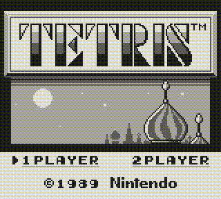

# 🎮 BoyBoy

[](https://isocpp.org/)
[](https://www.linux.org/)
[](LICENSE)

[](https://github.com/sebdevnull/boyboy/releases/latest)

**BoyBoy** is a work-in-progress **Game Boy emulator** written in C++23, designed to be accurate, maintainable, and easy for developers to explore and extend.  
It implements a complete CPU core, memory management, and a functional PPU for graphics rendering.  
BoyBoy provides a hands-on platform for learning about emulator development and low-level programming.

## Gameplay

|  |  |  |
|:---------------------:|:---------------------:|:---------------------:|
| *The Legend of Zelda: Link's Awakening* | *Super Mario Land 2: 6 Golden Coins* | *Kirby's Dream Land* |

|  |  |  |
|:---------------------:|:---------------------:|:---------------------:|
| *Tetris*     | *Dr. Mario*  | *Donkey Kong* |

> For full ROM compatibility status, check [Tested ROMs](docs/TestedROMs.md#games).

## Project goals

**BoyBoy** aims to be an accurate, maintainable, and developer-friendly Game Boy emulator.

The project is designed to:

- Faithfully emulate original Game Boy hardware: CPU, memory, I/O, graphics, and audio
- Run commercial and homebrew ROMs  
- Provide a developer-friendly debugging and testing environment
- Serve as a hands-on learning platform for emulator development and low-level programming for the community

## Project status

**BoyBoy** is currently in active development.  

**Current version:** [`v0.4.0`](CHANGELOG.md#040---2025-10-07)  

**Development stage:** Ongoing improvements and feature implementation.

**Progress overview:**

| Component             | Status        |
|-----------------------|---------------|
| CPU core              | ✅ Implemented |
| Memory & DMA          | ✅ Implemented |
| ROM & Cartridge       | ⏳ Partial     |
| PPU (graphics)        | ✅ Implemented |
| APU (audio)           | ❌ Not started |
| I/O & Peripherals     | ⏳ Partial     |
| CLI/GUI & Extras      | ⏳ Partial     |
| Testing & Validation  | ⏳ Partial     |

> For a detailed feature checklist, see [Feature Checklist](/docs/Checklist.md).  
> For detailed progress and changes, see [CHANGELOG](/CHANGELOG.md).

## Upcoming features

The following features are planned for future releases, in rough order of priority:

### Core

- **Save states** – Save and restore game state
- **Boot ROM** – Authentic startup sequence  
- **Timing accuracy** – More accurate CPU and PPU timing
- **Optimizations** – Further performance improvements

### Hardware

- **Cartridge support** – MBC2, MBC3, MBC5, battery-backed RAM, RTC
- **Audio (APU)** – Full audio emulation  

### Tools & UI

- **Debugging tools** – Breakpoints, step execution, memory/state inspection  
- **CLI improvements** – More options and features
- **GUI frontend** – Window management, controls, and visualization  

### Other

- **Testing** – Additional test ROMs to verify compatibility
- **Cross-platform** – Windows and macOS support  

## Resources

The following resources have been used in BoyBoy's development and may help you understand Game Boy hardware and emulation concepts:

- [**Awesome Game Boy Development**](https://github.com/gbdev/awesome-gbdev) – Curated (and ***awesome***) list of Game Boy development resources. The only list you'll ever need!

### Technical references

- [**Pan Docs**](https://gbdev.io/pandocs/) – The ***definitive*** technical reference for Game Boy hardware.
- [**Game Boy: Complete Technical Reference**](https://gekkio.fi/files/gb-docs/gbctr.pdf) – Comprehensive technical reference by [Gekkio](https://gekkio.fi/).
- [**The Cycle-Accurate Game Boy Docs**](https://github.com/AntonioND/giibiiadvance/blob/master/docs/TCAGBD.pdf) – Detailed analysis focused on cycle accuracy by [AntonioND](https://github.com/AntonioND).

### CPU instruction references

- [**Opcodes table**](https://gbdev.io/gb-opcodes/optables/) – Visual opcode table with cycle counts and flags. Views in hex and octal.
- [**Opcodes JSON**](https://gbdev.io/gb-opcodes/Opcodes.json) – Complete instruction set in JSON format (***great for parsing!***).
- [**Opcodes reference**](https://rgbds.gbdev.io/docs/v0.9.4/gbz80.7) – Detailed reference for the Game Boy CPU instruction set.

### Emulation

- [**Emulation of Nintendo Game Boy**](https://github.com/Baekalfen/PyBoy/blob/master/extras/PyBoy.pdf) – Academic paper on Game Boy emulation implementation in Python for the [PyBoy emulator](https://github.com/Baekalfen/PyBoy).

### Test ROMs

- [**Blargg's Test ROMs**](https://github.com/retrio/gb-test-roms) – Widely used test ROMs for CPU, PPU, and other hardware verification.
- [**dmg-acid2**](https://github.com/mattcurrie/dmg-acid2) – Basic PPU rendering test ROM.

## Dependencies

To build **BoyBoy**, the following libraries are required:

- [glad](https://github.com/Dav1dde/glad) – For loading OpenGL functions (included pregenerated header-only version in `external/glad/`)
- [SDL2](https://www.libsdl.org/) – For window management, input handling, and audio  
- OpenGL – For rendering graphics  

On Linux (Debian/Ubuntu), you can install them with:

```bash
sudo apt update
sudo apt install libsdl2-dev libglu1-mesa-dev mesa-common-dev
```

Make sure you have **CMake 3.27+** and a C++23 compiler.

## Build instructions

**Using CMake presets (recommended):**

1. Create and configure a build:

    ```bash
    cmake --preset debug   # or 'release'
    ```

2. Build the project:

    ```bash
    cmake --build --preset debug
    ```

3. Run tests:

    ```bash
    ctest --preset debug
    ```

## Test ROMs

This project includes several ROMs for emulator testing and verification.

> See [Tested ROMs](docs/TestedROMs.md#test-roms) for test ROMs passing status.  

The included test ROMs are:

- **blargg’s Game Boy test ROMs** – stored under `tests/roms/cpu/blargg/`, widely used for CPU, PPU, and other hardware verification  
  - [GitHub repository](https://github.com/retrio/gb-test-roms)  

- **dmg-acid2** – stored under `tests/roms/ppu/dmg-acid2.gb`, a PPU test ROM by Matt Currie (MIT license)
  - [GitHub repository](https://github.com/mattcurrie/dmg-acid2)

- **GameBoyLife ROM** – stored under `tests/roms/misc/gameboylife/` by NovaSquirrel (zlib license)  
  - [GitHub repository](https://github.com/NovaSquirrel/GameBoyLife)
  - [Itch.io page](https://novasquirrel.itch.io/conways-life-for-game-boy)

- **Custom ROMs** – stored under `tests/roms/misc/custom/`  
  - `invalid.gb` – created to test invalid or malformed data handling  

> See [Third-Party Licenses](LICENSE-THIRD-PARTY.md) for detailed attribution, licenses, and legal notices.

## Legal notice

- **BoyBoy** is an independent project and is **not affiliated with or endorsed by Nintendo**.  
- The Game Boy name, logo, and related trademarks are property of **Nintendo Co., Ltd.**  
- See [Third-Party Licenses](LICENSE-THIRD-PARTY.md) for third-party attributions and disclaimers.  
